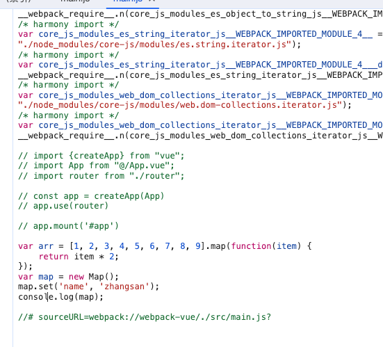

# 从0搭建webpack5开发环境

## 前言

起因是在开发时候突然想使用可选链点语法，后来去看了下babel版本是6,如果想使用可选链点语法需要babel7以上的版本，
然后就想着升级下babel，但是babel7以上的版本需要webpack5以上的版本，但是直接升级迁移会有很多问题，所以就想着自己先手搭一下webpack，顺便提高下自己对webpack的掌握度。

## webpack5带来的提升

先来看下webpack5带来的提升，这里只列举了一些比较重要的提升，具体可以看[官方文档](https://webpack.docschina.org/blog/2020-10-10-webpack-5-release/)

- **增加持久化存储能力，提升构建性能（核心）**
- 提升算法能力来改进长期缓存（降低产物资源的缓存失效率）
- 提升 Tree Shaking 能力降低产物大小和代码生成逻辑
- 提升 web 平台的兼容性能力
- 清除了内部结构中，在 Webpack4 没有重大更新而引入一些新特性时所遗留下来的一些奇怪的 state
- 通过引入一些重大的变更为未来的一些特性做准备，使得能够长期的稳定在 Webpack5 版本上

## 环境配置

### 初始化项目

新建项目根目录文件夹，文件夹命名为项目名称。进入文件夹，执行下列命令：

```shell
npm init -y
```

根目录下会生成`package.json`文件，修改如下：

```json
{
  "name": "webpack5-vue-template",
  "version": "1.0.0",
  "description": "",
  "main": "index.js",
  "scripts": {},
  "keywords": [],
  "author": "lvjialei",
  "license": "ISC"
}
```

### 安装webpack

执行命令

```shell
npm install webpack webpack-cli -D
```

package.json 中会出现：

```json
{
  "name": "webpack5-vue-template",
  //...
  "devDependencies": {
    "webpack": "^5.89.0",
    "webpack-cli": "^5.1.4"
  }
}

```

### 配置webpack

项目根目录下创建`build`目录，并在其中新建三个js文件

1. `webpack.base.js`：公共配置
2. `webpack.dev.js`：开发环境配置
3. `webpack.prod.js`：生产环境配置

修改`package.json`文件，添加`scripts`字段：

```json
{
  //...
  "scripts": {
    "build:dev": "webpack --progress --config ./build/webpack.dev.js",
    "build": "webpack --progress --node-env production --config ./build/webpack.prod.js"
  },
  //...
}
```

在根目录下新建`src`目录，用于存放业务代码，在其中新建`main.js`、`assets`。
`assets`目录内新建`fonts`以及`img`目录，用于存放字体文件以及图片文件。

### 安装webpack-merge

```shell
npm install webpack-merge -D
```

**webpack.common.js**

```js
const path = require('path');

module.exports = {
  entry: {
    main: path.resolve(__dirname, '../src/main.js')
  },
  output: {
    path: path.resolve(__dirname, '../dist')
  },
}
```

**配置resolve:省略部分经常用到的文件路径**

```js

// ...

module.exports = {
  entry: {
    // ...
  },
  resolve: {
    // 别名
    alias: {
      '@': path.resolve(__dirname, '../src'),
      '@img': path.resolve(__dirname, '../src/assets/img')
    },
    // 省略后缀
    extensions: ['.js', '.vue']
  },
  // ...
}
```

**webpack.dev.js**

```js
const {merge} = require('webpack-merge')
const commonConfig = require('./webpack.common')
const mode = process.env.NODE_ENV === 'production' ? 'production' : 'development'

const devConfig = {
  mode,
  // 配置输出文件名
  output: {
    filename: 'js/[name].js',
    chunkFilename: 'js/[name].chunk.js'
  }
}

module.exports = merge(commonConfig, devConfig)
```

**webpack.prod.js**

```js
const { merge } = require('webpack-merge')
const commonConfig = require('./webpack.common')
const mode = process.env.NODE_ENV === 'production' ? 'production' : 'development'

const prodConfig = {
  mode,
  output: {
    filename: 'js/[name].[contenthash:8].js',
    chunkFilename: 'js/[name].[contenthash:8].chunk.js'
  }
}

module.exports = merge(commonConfig, prodConfig)
```

**dist目录下生成index.html**

在根目录下新建`/public/index.html`
    
```html
<!DOCTYPE html>
<html lang="en">
<head>
  <meta charset="UTF-8">
  <meta http-equiv="X-UA-Compatible" content="IE=edge">
  <meta name="viewport" content="width=device-width, initial-scale=1.0">
  <title><%= htmlWebpackPlugin.options.title %></title>
</head>
<body>
  <div id="app"></div>
</body>
</html>

```

### 安装html-webpack-plugin 插件依赖：

```shell
npm install html-webpack-plugin -D
```

在`webpack.common.js`中引入插件：

```js
// ...
const HtmlWebpackPlugin = require('html-webpack-plugin')

module.exports = {
  // ...
  plugins: [
    new HtmlWebpackPlugin({
      template: path.resolve(__dirname, '../public/index.html'),
      title: 'This is a template'
    })
  ],
  output: {
    // ...
  }
}
```

### 安装webpack-dev-server

```shell
npm install webpack-dev-server -D
```

在`webpack.dev.js`中配置`devserver`属性：

```js
const path = require('path')
// ...

const devConfig = {
  // ...
  devServer: {
    static: path.resolve(__dirname, '../dist'),
    port: 3000,
    open: true,
    hot: true
  },
  output: {
    // ...
  }
}

// ...
```

在`package.json`中修改`scripts`字段：

```json
{
  // ...
  "scripts": {
    "dev": "webpack-dev-server --config ./build/webpack.dev.js",
    // ...
  },
  // ...
}
```

## 配置babel

安装依赖

```shell
npm install babel-loader @babel/core @babel/preset-env -D
```

安装生产依赖
    
```shell
npm install @babel/polyfill croe-js -S
```

在`webpack.common.js`中配置`babel-loader`：

```js
// ...
module.exports = {
  // ...
  module: {
    rules: [
      {
        test: /\.js$/,
        exclude: /node_modules/,
        loader: 'babel-loader'
        //或者
        //use: ['babel-loader']
      }
    ]
  },
  // ...
}
```

在根目录下新建`.babelrc`文件：

```json
{
  "presets": [
    [
      "@babel/preset-env",
      {
        "useBuiltIns": "usage",
        "corejs": 3
      }
    ]
  ]
}
```

babel之前的代码：


babel之后的代码：



## css文件处理

这里示例使用的是less。先安装依赖：

```shell
npm install less less-loader css-loader style-loader postcss-loader -D
```

css样式转换是在打包的时候转换的，所以安装的是开发依赖。在`webpack.dev.js`中配置：
`注:` 
1. webpack中loader的执行顺序是从右到左，从下到上
2. `importLoaders: 1`表示在css-loader之前执行1个loader，也就是postcss-loader
3. 

    
```javascript
// ...

const devConfig = {
  // ...
  module: {
    rules: [
      {
        test: /\.css$/,
        use: [
          {
            loader: 'css-loader',
            options: {
              importLoaders: 1
            }
          },
          'postcss-loader'
        ]
      },
      {
        test: /\.less$/,
        use: [
          {
            loader: 'css-loader',
            options: {
              importLoaders: 2
            }
          },
          'postcss-loader',
          'less-loader'
        ]
      }
    ]
  },
  output: {
    // ...
  }
}

// ...

```

这里使用到了`postcss`，所以在根目录下新建其配置文件`postcss.config.js`:

```js
module.exports = {
  plugins: [
    require('autoprefixer') // 属性根据浏览器不同，自动添加样式前缀
  ]
}
```

在babel中配置browserlist，用于配置兼容的浏览器：

```json
{
  "presets": [
    [
      "@babel/preset-env",
      {
        "useBuiltIns": "usage",
        "corejs": 3,
        "modules": false,
        "targets": {
          "browsers": ["> 1%", "last 2 versions", "not ie <= 8"]
        }
      }
    ]
  ],
}
```


**优化**： 在生产环境中，抽离成单独的css样式文件，并且压缩样式代码。开发环境不需要。

1. 安装依赖：

```shell
npm install mini-css-extract-plugin css-minimizer-webpack-plugin -D
```

这里使用`mini-css-extract-plugin`插件抽离css样式文件，使用`css-minimizer-webpack-plugin`插件压缩css样式文件。

官方文档：[mini-css-extract-plugin](https://webpack.docschina.org/plugins/mini-css-extract-plugin/)、[css-minimizer-webpack-plugin](https://webpack.docschina.org/plugins/css-minimizer-webpack-plugin/)


2. 在`webpack.prod.js`中配置：

```js
// ...
const MiniCssExtractPlugin = require('mini-css-extract-plugin')
const CssMinimizerPlugin = require('css-minimizer-webpack-plugin')
// ...

const prodConfig = {
  // ...
  module: {
    rules: [
      {
        test: /\.css$/,
        use: [
          // 压缩css文件，需配置的loader
          MiniCssExtractPlugin.loader,
          {
            loader: 'css-loader',
            options: {
              importLoaders: 1
            }
          },
          'postcss-loader'
        ]
      },
      {
        test: /\.less$/,
        use: [
          // 压缩css文件，需配置的loader
          MiniCssExtractPlugin.loader,
          {
            loader: 'css-loader',
            options: {
              importLoaders: 2
            }
          },
          'postcss-loader',
          'less-loader'
        ]
      }
    ]
  },
  optimization: {
    minimizer: [
      // 在 webpack@5 中，你可以使用 `...` 语法来扩展现有的 minimizer（即 `terser-webpack-plugin`），将下一行取消注释
      // `...`,
      new CssMinimizerPlugin(),
      // 这将仅在生产环境开启 CSS 优化。
      // 如果还想在开发环境下启用 CSS 优化，请将 optimization.minimize 设置为 true:
    ]
  },
  plugins: [
    new MiniCssExtractPlugin({
      // 决定输出的每个 CSS 文件的名称
      filename: 'css/[name].[contenthash:8].css',

      // 决定非入口的 chunk 文件名称,仅在 webpack@5 下可用
      chunkFilename: 'css/[name].[contenthash:8].chunk.css'
    })
  ],
  output: {
    // ...
  }
}

// ...

```

## 对字体、图片、媒体等静态资源的打包

配置`webpack.common.js`：

```js
// ...
module.exports = {
  // ...
  module: {
    rules: [
      // ...
      {
        test: /\.(ttf|woff|woff2|eto|svg)$/,
        exclude: path.resolve(__dirname, '../src/asset/fonts'),
        type: 'asset',
        parser: {
          dataUrlCondition: {
            // 如果一个模块源码大小小于 maxSize，那么模块会被作为一个 Base64 编码的字符串注入到包中， 否则模块文件会被生成到输出的目标目录中。
            maxSize: 4 * 1024
          }
        },
        generator: {
          filename: isProduction
            ? 'static/fonts/[name].[contenthash:8][ext]'
            : 'static/fonts/[name][ext]'
        }
      },
      {
        test: /\.(jpe?g|png|gif|svg)$/,
        exclude: path.resolve(__dirname, '../src/assets/img'),
        type: 'asset',
        parser: {
          dataUrlCondition: {
            maxSize: 4 * 1024
          }
        },
        generator: {
          filename: isProduction ?
            'static/img/[name].[contenthash:8][ext]' :
            'static/img/[name][ext]'
        }
      },
      {
        test: /\.(mp4|webm|ogg|mp3|wav|flac|aac)$/,
        type: 'asset/resource',
        generator: {
          filename: isProduction ?
            'static/video/[name].[contenthash:8][ext]' :
            'static/video/[name][ext]'
        }
      }
    ]
  },
  // ...
}
```

关于rules.Rule.type ，即资源模块的说明，详见[官方文档](https://webpack.docschina.org/guides/asset-modules/)


## Vue编译配置

安装依赖
1. 安装vue `npm i vue`
2. 安装vue-loader `npm i vue-loader@next -D`
3. 如果是vue3，还需要安装vue3的编译器 `npm i @vue/compiler-sfc -D`

```shell
# 第一步
npm i vue 

# 第二步

# vue2
npm i vue-loader -D

# vue3
npm i vue-loader @vue/compiler-sfc -D
```

在`webpack.common.js`中配置：

```js
// ...
const { VueLoaderPlugin } = require('vue-loader')
// ...

module.exports = {
  // ...
  module: {
    rules: [
      ...
      {
        test: /\.vue$/,
        loader: 'vue-loader'
      },
      // ...
    ]
  },
  plugins: [
    // ...
    new VueLoaderPlugin()
  ],
  // ...
}

```
**App入口**

在`src`目录下 新建`App.vue`文件: 
```vue

<template>
  <div class="app">{{ msg }}</div>
</template>

<script>
  export default {
    name: 'App',
    data() {
      return {
        msg: 'Hello world'
      }
    }
  }
</script>

<style lang="stylus" scoped>
  .app {
    color: skyblue
  }
</style>


```

在`src`目录下,新建`main.js`:
```js
import { createApp } from 'vue'
import App from './App'

const app = createApp(App)

app.mount('#app')

```


**至此，vue开发环境已经搭建完成！**

## vue-router与pinia

这里相对简单,可自行百度...


## 其他配置

**环境变量**

在`webpack.common.js`中配置：
在vue3.x 项目中需要设置两个变量，以更好地进行 tree-shaking


```js
// ...
const webpack = require('webpack')
// ...

module.exports = {
  // ...
  plugins: [
    // ...
    new webpack.DefinePlugin({
      __VUE_OPTIONS_API__: true,
      __VUE_PROD_DEVTOOLS__: false
    })
  ],
  // ...
}

```

**SourceMap**

该配置一般只在开发环境中需要，所以在webpack.dev.js 中配置devtool：

```js
// ...

const devConfig = {
  mode,
  devtool: 'eval-cheap-module-source-map',
  // ...
}

// ...

```

**缓存的使用**

在webpack5中，可以使用`cache`字段来配置缓存，以提高二次构建的速度。在`webpack.common.js`中配置：
`注`：
webpack5 内部对于 cache 的优化和利用已经非常好了，不需要再使用 webpack4 阶段用来优化缓存的 loader 和 plugin 来提升性能，只会引发未知的问题，建议全部去掉。


```js
// ...

module.exports = {
  // ...
  cache: {
    type: 'filesystem',
    buildDependencies: {
      config: [__filename]
    }
  }
  // ...
}
// ...
```


除此之外,应当还有一些插件可以使用,比如
1. `terser-webpack-plugin`: 压缩js代码
2. `webpack-bundle-analyzer`：分析打包后的文件大小
3. `friendly-errors-webpack-plugin`：更好的提示错误和警告信息
4. `copy-webpack-plugin`：拷贝静态资源
5. `webpackbar`：更好的显示打包进度
6. `compression-webpack-plugin`：开启gzip压缩


...

## 总结

本文只是对webpack5的一些基本配置，还有很多细节没有涉及到。

在后来升级过程中还发现了许多难以理解的报错，包括但不限于`vue-loader`版本过高导致的报错、一些`库`的版本不兼容导致的报错、`业务代码`中的一些语法不兼容导致的报错等等。

遇到这些问题不要急，一个一个解决，多看看`报错信息`、`官方文档`，、`github上的issue`或者直接问`ChatGPT`。